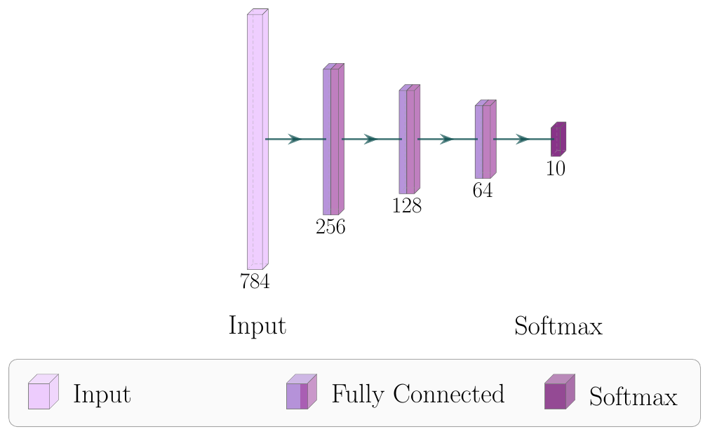
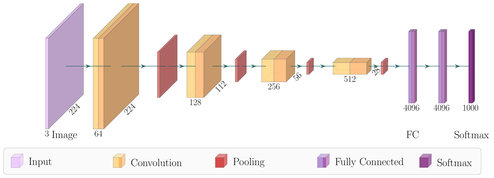
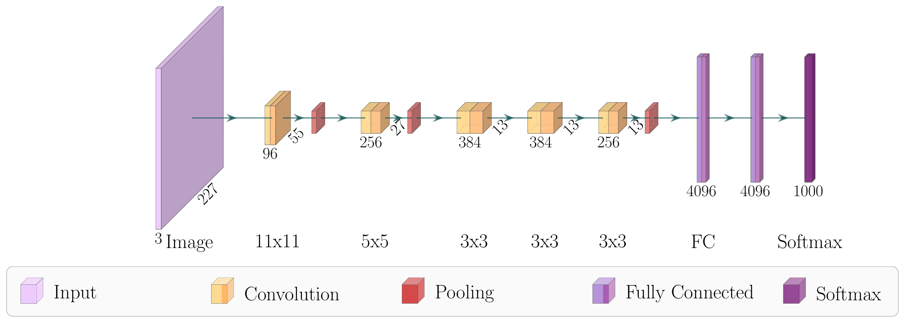
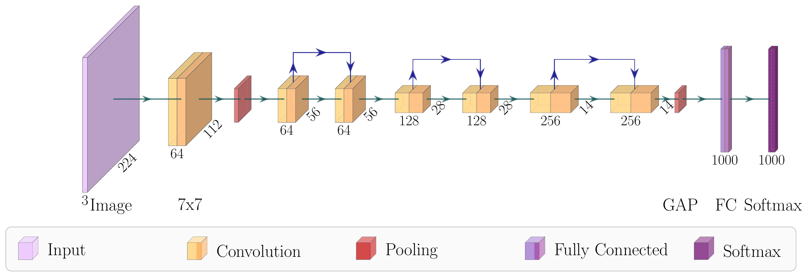
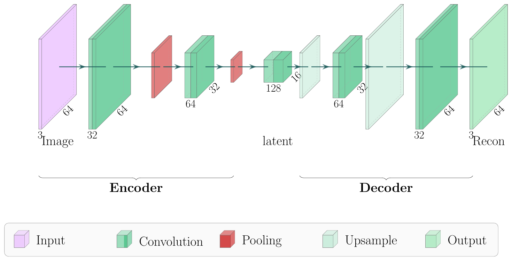
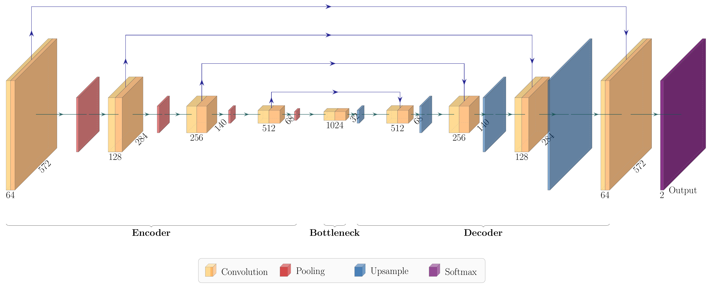
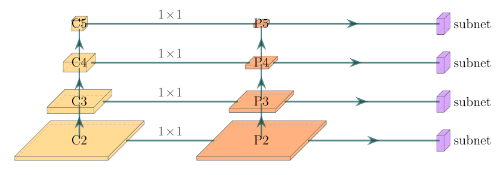
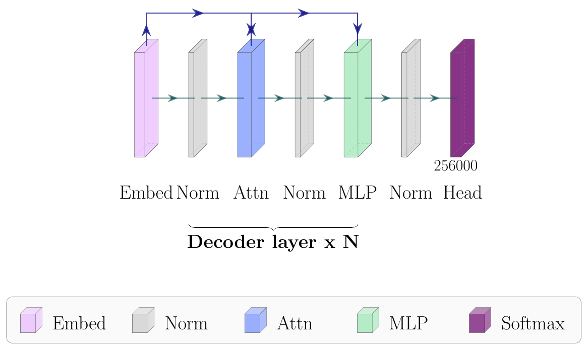
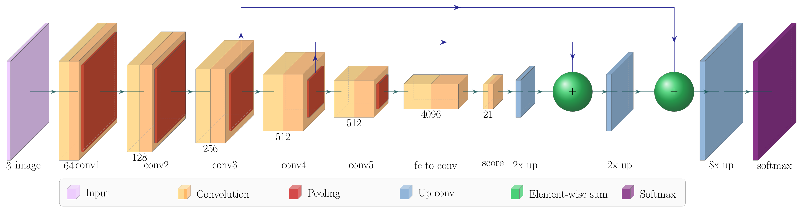
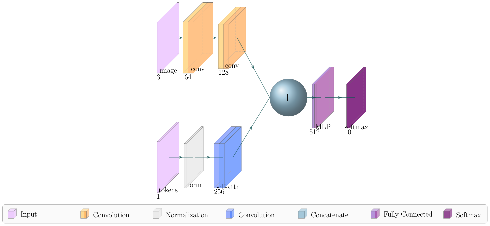

# AutoPlotNeuralNet

> **Still in progress** — the diagram design is functional but still being
> refined; expect layout and styling to keep improving.

Config-driven TikZ diagrams of neural networks. Write a small YAML file, get a
`.tex` / PDF / PNG of your architecture — no manual TikZ.

```
config (YAML)  ->  apnn  ->  .tex  ->  PDF / PNG
```

## Gallery

Every diagram below is generated from a bundled template — no manual TikZ.
Run `uv run apnn render src/apnn/templates/<name>.yaml -o out/<name> --to png`.

### FFN — feedforward / MLP


### CNN classifier


### AlexNet


### ResNet — residual skip connections


### Autoencoder — encoder / decoder


### U-Net — auto skip connections per resolution level


### RetinaNet / FPN — stacked feature-map pyramid


### Gemma — decoder-only transformer (block level)


### FCN-8s — fully convolutional, skip-stream fusion


### Multi-branch — free layout, two streams fused by concatenation


## Requirements

- Python managed via [`uv`](https://docs.astral.sh/uv/)
- A LaTeX distribution providing `pdflatex` (rendering to PDF)
- `pdftoppm` from poppler (rendering to PNG) — optional, only for `--to png`

## Install

```bash
uv sync
```

## Usage

```bash
# render a bundled template
uv run apnn render src/apnn/templates/ffn.yaml -o examples/ffn --to png

# scaffold your own config from a template
uv run apnn new ffn > my_net.yaml
uv run apnn render my_net.yaml --to pdf

# check a config without rendering (no LaTeX needed)
uv run apnn validate my_net.yaml

# discover building blocks
uv run apnn list-templates
uv run apnn list-node-types
uv run apnn list-layouts
```

`--to` accepts `tex`, `pdf` (default) or `png`. `-o/--out` is the output path
without extension. Add `-v` for debug logging.

## Config format

```yaml
name: ffn                 # also used as the output file stem
layout: sequential        # how layers are arranged (default: sequential)
theme: default            # default | nature | grayscale
colors:                   # optional per-type color overrides
  fc: "rgb:blue,5;red,2.5;white,5"
sizing:                   # optional, all fields default (see below)
  mode: spatial           # spatial (face from resolution, thickness from channels)
                          #   | units (height from channels, FFN) | plate (flat FPN sheet)
  ref_resolution: 224     # resolution mapped to ref_size
  ref_size: 40            # box height/depth at ref_resolution
  min_size: 8             # smallest box height/depth
  ref_channels: 64        # channel count mapped to ref_width
  ref_width: 2.5          # box thickness at ref_channels
  min_width: 1.0
  max_width: 8.0
  max_size: 60.0          # largest box height/depth
  unit_thickness: 2.5     # box width/depth in 'units' mode
legend: true
font_scale: auto          # auto-derives a scale from the rendered width so fonts
                          # read consistently; a number (e.g. 1.4) forces it
layers:
  - {type: input,   name: in,  channels: 784, caption: Input}
  - {type: fc,      name: h1,  channels: 256, caption: Dense}
  - {type: softmax, name: out, channels: 10,  caption: Softmax}
sections: []              # optional bracket groups: [{from, to, label}]
connections: []           # optional manual edges: [{from, to, style, ...}]
                          #   style: solid (default) | dashed | skip
                          #   skip_pos: arc height for skip edges
                          #   from_anchor/to_anchor: e.g. north, southeast (default east/west)
                          #   label: author LaTeX drawn above the edge, e.g. "$1\times1$"
```

Available layer types (see `apnn list-node-types`): `input`, `output`, `fc`,
`softmax`, `conv`, `conv_block`, `pool`, `upsample`, `deconv` (up-convolution),
`sum` (element-wise `+` ball), `concat` (`‖` ball), `norm` (normalization),
`block` (a generic labelled box for custom / 2D diagrams).
Layouts (see `apnn list-layouts`):
- `sequential` — FFN / CNN classifier (single row)
- `flow` — like `sequential`, but pooling is fused flush onto its conv (FCN / VGG)
- `encoder_decoder` — UNet, with automatic skip connections per resolution level
- `pyramid` — RetinaNet / FPN; place nodes in columns via the `col` field
  (col 0 = backbone, col 1 = feature pyramid, col 2 = subnets) and levels are
  stacked by `resolution`
- `free` — place every node at an explicit `x`/`y` (diagram units) and wire it up
  with manual `connections`; for multi-branch / non-standard topologies

Bundled templates: `ffn`, `cnn`, `alexnet`, `resnet`, `autoencoder`, `unet`,
`retinanet`, `gemma`, `fcn8`, `multibranch` (see `apnn list-templates`, and the
gallery above).

Note: in xcolor `rgb:` color expressions, avoid the named color `orange`
(it renders incorrectly) — mix `red` + `yellow` instead.

Names (`name`, and `from`/`to` references) must be valid identifiers
(`[A-Za-z][A-Za-z0-9_-]*`); colors must be xcolor expressions, named colors or
hex codes. Captions are literal text (special LaTeX characters are escaped
automatically). Connection `label`s are raw LaTeX so math works (e.g.
`"$1\times1$"`); file/shell commands like `\input` or `\write` are rejected.

Each layer may override `color`, `band_color`, `opacity`, and the box geometry
(`height`, `width`, `depth`); otherwise geometry is derived from `resolution` and
`channels` via the `sizing` config.

## From a PyTorch model

Turn a saved `.pt` into a config automatically (needs the optional `torch` extra):

```bash
pip install 'autoplotneuralnet[torch]'   # or: uv pip install 'autoplotneuralnet[torch]'

# a whole saved model (torch.save(model, ...)) — no --arch needed
uv run apnn from-torch model.pt --input 1,3,224,224 -o model.yaml

# only weights (a state_dict, the usual download) — rebuild the graph via torchvision
uv run apnn from-torch resnet50.pt --arch resnet50 -o resnet50.yaml

uv run apnn render model.yaml --to png
```

It runs one example forward pass, reads each layer's output shape via hooks, and
maps modules to nodes (Conv→`conv`, pooling→`pool`, Linear→`fc`, …); activations
and norm layers are folded out, and repeated identical stages (e.g. a ResNet
`layer1`) collapse to a single `block` captioned `layer1 x2`.

Limits: a state_dict holds no topology, so a custom (non-torchvision) model needs
its config written by hand — read the layer sizes off the weight shapes (it's a
clear error message, not a crash). The stage view also serialises parallel
branches (Inception, SqueezeNet Fire), so branchy nets lose their split/merge
structure. Straight backbones (ResNet, VGG, AlexNet) come out exact.

## Hand-written `.tex` (advanced)

For topologies the config can't express, drop to raw TikZ while reusing apnn's
3D primitives and themes:

```bash
# a compilable, hand-editable .tex (+ a self-contained styles/ folder),
# seeded from a template and annotated with an anchor cheatsheet
uv run apnn scaffold-tex cnn -o my_fig
# pdflatex my_fig.tex

# or just drop the style files next to your own document
uv run apnn export-styles styles
```

The styles are loaded with `\usepackage{import}` + `\subimport{styles/}{init}`,
which pulls in `Box`, `RightBandedBox` and `Ball`, the fonts (`\fntlg`,
`\fntmd`, `\fntsm`), the edge colour `\edgecolor`, and the `connection` style.

Each `Box` / `RightBandedBox` / `Ball` pic named `n` exposes these anchors:

| anchor | position |
|--------|----------|
| `n-west` `n-east` | left / right centre |
| `n-north` `n-south` | top / bottom centre |
| `n-anchor` | centre |
| `n-northeast` `n-northwest` `n-southeast` `n-southwest` | front-face corners |
| `n-near` `n-neareast` `n-nearwest` | front-face centre / corners |

```latex
\pic[shift={(3,0,0)}] at (a-east)
  {Box={name=b, fill={rgb:yellow,5;red,2.5;white,5},
        height=30, width=2, depth=30, caption=conv}};
\draw[connection] (a-east) -- node{\midarrow} (b-west);
```

## Python API

The CLI is a thin layer over a builder API:

```python
from apnn import Diagram, load_config, render

diagram = Diagram.from_config(load_config("my_net.yaml"))
render(diagram, "examples/ffn", fmt="png")
```

## Logging

Logging uses the standard `logging` module; pass `-v` to the CLI for `DEBUG`
output, otherwise it logs at `INFO`. When using the Python API directly, call
`logging.basicConfig()` yourself to see log output.

## Credits

Inspired by [PlotNeuralNet](https://github.com/HarisIqbal88/PlotNeuralNet).
